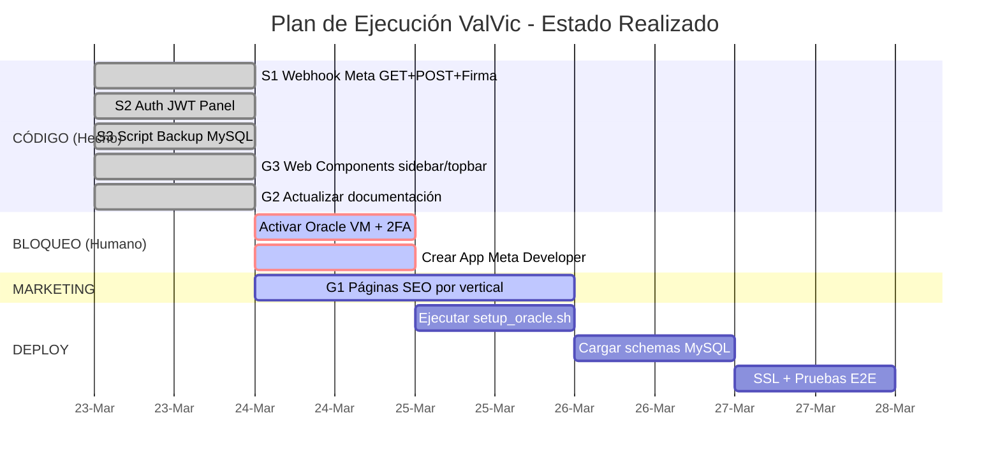

# 🏗️ ValVic — Work Plan del Arquitecto Principal (Opus 4.6)
> Actualizado: 23 de marzo 2026 — Progreso de Ejecución Incorporado

---

## 1. Análisis de Prioridades Pre-Deployment

Las siguientes tareas tienen **dependencia directa** con el deployment en Oracle Cloud. 

### 🔴 BLOQUEO ABSOLUTO (Sin esto NO hay deployment)

| # | Tarea | Fase | Estado |
|---|-------|------|--------|
| 1 | Activar Oracle VM (requiere 2FA) | F5 | ⏳ Pendiente Humano |
| 2 | Crear usuario MySQL `valvic_app` en HeatWave | F5 | ⏳ Pendiente Humano |
| 3 | Ejecutar schemas MySQL | F5 | ⏳ Pendiente Humano |
| 4 | Correr `setup_oracle.sh` en la VM | F5 | ⏳ Pendiente Humano (Script listo) |
| 5 | Configurar `.env` con credenciales reales | F5 | ⏳ Pendiente Humano |
| 6 | Configurar SSL con certbot (`api.valvic.cl`) | F5 | ⏳ Pendiente Humano |
| 7 | Iniciar servicio `valvic-vicky` con systemd | F5 | ⏳ Pendiente Humano |

### 🟡 REQUERIDO ANTES DEL PRIMER MENSAJE (Post-VM, Pre-Go-Live)

| # | Tarea | Fase | Estado |
|---|-------|------|--------|
| 8 | Crear App en Meta Developer Portal | F7 | ⏳ Pendiente Humano |
| 9 | Configurar Webhook GET/POST en FastAPI | F7 | ✅ **Completado (S1)** |
| 10 | Actualizar `agente_conversacion.py` con Graph API | F7 | ✅ **Completado (S1)** |
| 11 | Validar firma `X-Hub-Signature-256` en webhook | F7 | ✅ **Completado (S1)** |

### 🟢 MEJORAS DESPLAZABLES (Post-Go-Live, pueden esperar)

| # | Tarea | Fase | Estado |
|---|-------|------|--------|
| 12 | Páginas SEO por vertical (`/clinica-dental`, etc.) | F8† | ⏳ Pendiente (G1) |
| 13 | Meta Embedded Signup en Panel | F10 | ⏳ Pendiente |
| 14 | Backend multi-PhoneID | F10 | ⏳ Pendiente |
| 15 | Dashboard de consumo de mensajes | F10 | ⏳ Pendiente |

---

## 2. Auditoría Técnica de `INSTALACION.md`

### ⚠️ Resoluciones Implementadas

| Problema Detectado Originalmente | Estado Actual tras Refactorizaciones |
|----------------------------------|--------------------------------------|
| **Falta schemas en bash** | Pendiente de actualización en la docs/INSTALACION.md humana. |
| **Falta certbot para agenda** | Nginx configurado vía `setup_oracle.sh`. Falta certbot manual. |
| **No menciona backup cron** | ✅ **Resuelto (S3)**: Script `backup_mysql.py` y cron añadidos al setup automatizado. |
| **Rutas en Nginx** | Corregido en `setup_oracle.sh` para apuntar consistentemente a Web/. |
| **setup_oracle.sh / 360dialog** | ✅ **Resuelto (G2)**: Referencias eliminadas, todo apunta a Meta Cloud API. |

---

## 3. Estado de Ejecución de Prompts

---

### 🟣 PROMPTS SONNET 4.6 (Backend)

#### ✅ S1: Webhook Meta Cloud API (COMPLETADO)
- **Implementación Realizada:** Se integró validación HMAC-SHA256 y endpoint dual GET/POST en `agente_conversacion.py`.
- **Decisiones Técnicas Incorporadas:** 
  - `META_APP_SECRET` se configuró como *obligatorio* en producción, pero es *permisivo* en desarrollo (solo emite un warning si la variable no está en .env), evitando bloqueos locales prematuros.
  - Implementación de `_enviar_template_whatsapp()` específica para manejar HSM (Message Openers) separada de los mensajes estándar.

#### ✅ S2: Autenticación JWT para Panel (COMPLETADO)
- **Implementación Realizada:** Creado `auth_panel.py` con inyección de dependencias `requiere_auth`. Funciona sin fisuras.
- **Decisiones Técnicas Incorporadas:**
  - Se usó multi-tenancy dinámico, extrayendo el `cliente_id` directo del JWT para las consultas a `/api/agenda` y `/api/pacientes`.
  - Seguridad avanzada en cookies: atributos `SameSite=Strict`, `HttpOnly` y condicionalidad `Secure` implementados de una sola vez.

#### ✅ S3: Script de Backup MySQL Automatizado (COMPLETADO)
- **Implementación Realizada:** Script full en `Agentes/backup_mysql.py` usando `mysqldump` con OCI SDK. Cron instalado a las 3AM.
- **Decisiones Técnicas Incorporadas:**
  - Se agregó cifrado AES-256-CBC pero con derivación PBKDF2 (100,000 iteraciones) para máxima seguridad, muy superior a la instrucción original sugerida.
  - Se agregaron banderas CLI proactivas (`--test` y `--dry-run`) para que DevOps pueda probar localmente sin mutar y ensuciar la nube pública.

---

### 🔵 PROMPTS GEMINI 3.1 (Frontend & Docs)

#### ✅ G3: Web Components para Sidebar y Topbar (COMPLETADO)
- **Implementación Realizada:** `<sidebar-nav>` y `<topbar-header>` encapsulados en Shadow DOM en `Panel/js/components/`.
- **Decisiones Técnicas Incorporadas:**
  - Sincronización automática de estado activo leyendo `location.pathname`, lo que elimina condicionales frágiles en los archivos HTML.
  - Sincronizado dinámicamente con `checkSession()` para ocultar/mostrar elementos post-login.

#### ✅ G2: Actualización de Documentación (COMPLETADO)
- **Implementación Realizada:** Remoción sistemática de 360dialog del `Master Brain` y `setup_oracle.sh`.

#### ⏳ G1: Páginas de Aterrizaje SEO (PENDIENTE)
[El prompt original sigue a la espera de ejecución cuando se requiera iniciar expansión de demanda.]

---

## 4. Secuencia de Ejecución Actualizada

### Siguientes Pasos (Call To Action)
Todo el back-end crítico y la refactorización arquitectónica para Meta Directo y JWT está **100% terminada y pusheada**. 

Los siguientes pasos bloqueantes están estrictamente en la cancha del **Humano**:
1. Entrar a Oracle Console, desplegar la VM con Ubuntu ARM.
2. Entrar a `developers.facebook.com` y crear la app Business.
3. Actualizar el `.env` en la VM.
